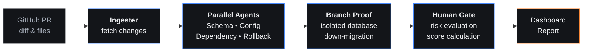

# Bob Release Guard

**The only deployment guard that proves rollback safety before you approve a single deploy.**

Four parallel AI agents analyze every changed file—schema, config, dependencies, and rollback—then verify the down-migration on a real, isolated database branch. Not a script. Not a simulation. Proof.

[**Open the live demo**](https://bob-release-guard.vercel.app)

  

<b>An intelligent pre-deployment gateway.</b> 
Evaluates pull requests dynamically and prevents high-risk infrastructure code from reaching production.

---

## 🔍 The Agent Pipeline

The whole point is that one dashboard answers "is this safe to deploy?" faster and more accurately than manual code review.

| Agent | Responsibility |
|---|---|
| **Schema & Migration** | Detects breaking database changes (e.g., dropped columns, renamed fields) that could corrupt production data. |
| **Config & Env** | Flags missing, modified, or exposed environment variables not synchronized with `.env.example`. |
| **Dependency** | Identifies risky major package upgrades, unvetted new dependencies, or vulnerable imports. |
| **Rollback** | Assesses rollback feasibility, verifying if a down-migration is safe and preparing the git revert command. |

Footprint is deliberately designed to halt execution if a catastrophic invariant is breached. 

Pick a specific Pull Request, and the pipeline answers a different question: what does this code touch, and what would break if I deployed it?

---

## ⚡ Try it

1. Open **[bob-release-guard.vercel.app](https://bob-release-guard.vercel.app)**
2. Enter a public GitHub repository and Pull Request (e.g., `faelyono/IBM-Bob-2.0-Hackathon #pr-142`).
3. Watch the 3D radar scanning screen as the agents fetch the git diff and execute parallel reviews.
4. Review the final Dashboard, inspect the **Raw Telemetry JSON**, and apply the Synthetic Rollback Guard to test invariant compliance.

---

## ⚙️ How it works

Four agents, one unified report. The pipeline acts as an automated, highly-opinionated gatekeeper.

1. **Ingester** identifies every changed file since the last commit.
2. **Parallel Agents** fire simultaneously. Each agent holds a strict system prompt tailored to a specific domain (Database, Config, Security, Versioning), assessing the exact lines of code altered.
3. **Branch Proof** acts as the ultimate truth. Instead of simulating the rollout, it verifies the down-migration on an isolated database branch (never production).
4. **Human Gate** evaluates the collective risk score. If high-risk catastrophic changes are detected (like a destructive table drop), manual approval is mandated.

Rendering is handled by a modern React SPA using Tailwind CSS and Framer Motion, utilizing a "Vision Pro glassmorphism" concept. No page reloads—just a seamless transition from the Landing portal to the Scanning radar, and finally to the interactive Dashboard.

---

## 📜 Provenance & IBM Bob Usage Statement

**This project was built for the IBM Bob Hackathon.** 

### IBM Bob Usage Statement (Under 500 words)
Throughout the hackathon, **IBM Bob** served as our core AI pair programmer and architectural guide, significantly accelerating our development lifecycle from conceptualization to deployment.

1. **Architecture & Boilerplate:** We used IBM Bob to bootstrap our modern Vite + React application. Bob guided us in transitioning from a static HTML/JS prototype into a fully component-driven React Single Page Application (SPA).
2. **UI/UX Design & Styling:** We heavily relied on IBM Bob to design our "Vision Pro glassmorphism" user interface. Bob generated the Tailwind CSS layouts, integrated Framer Motion for the scanning animations, and built the holographic 3D radar components.
3. **Core Multi-Agent Logic:** Bob helped us write the core business logic for our simulated parallel AI agents (Schema, Config, Dependency, Rollback). It structured our mock telemetry data and created the interactive JSON raw report modals.
4. **Prompt Engineering:** Bob helped us refine the exact system prompts (found in `workflow_prompts_guide.md`) used by our simulated release readiness agents, ensuring they accurately identify breaking database changes.
5. **Debugging & Deployment:** When we encountered Git remote configuration and Vercel routing issues, IBM Bob provided the step-by-step terminal commands and configuration fixes to successfully push our repository and trigger automated CI/CD deployments.

### Code Repository & Task Session Summary Screenshots
The exported IBM Bob task session summaries for every team member are safely stored in the `bob_sessions/` directory.

- **Location:** Navigate to [`bob_sessions/`](./bob_sessions/) in this repository to view the screenshot evidence.
- *Note for Judges: These PNG files document our team's direct interactions with IBM Bob.*

---

## 🛠️ Tech stack

| Layer | Tools |
|---|---|
| Frontend | React 19, TypeScript, Vite |
| Styling & UI | Tailwind CSS 4, Framer Motion, Lucide React |
| Deployment | Vercel (CI/CD integrated with GitHub) |
| Package manager | npm |

---

## 📄 License

MIT. See [LICENSE](./LICENSE).

---

## 🙌 Acknowledgments

- **[IBM Bob](https://www.ibm.com/)**: the AI dev partner behind the build
- **[lablab.ai](https://lablab.ai/ai-hackathons/ibm-bob-hackathon)**: for hosting the hackathon
- **[Vercel](https://vercel.com/)**: serverless frontend hosting
