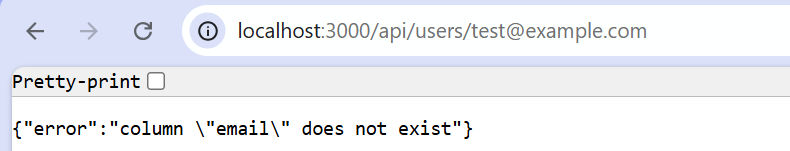

# Manual Rollback Proof — Release Readiness Copilot

## Context

Bob's `execute_command` sandbox does not have outbound HTTPS access to the 
Neon API (`console.neon.tech`), confirmed via direct testing: TCP connections 
succeed, but TLS/HTTPS requests hang indefinitely inside Bob's execution 
environment. This was verified by running identical commands both inside 
Bob's sandbox and from the host machine's native terminal — only the host 
terminal could complete the HTTPS request successfully.

As a result, the Rollback Agent's branch-based verification was completed 
manually from the host terminal, using the same logic the agent was designed 
to execute (create isolated branch → run down-migration → verify → cleanup).

## Steps performed

1. **Created an isolated Neon branch** named `rollback-test-demo`, branched 
   from `production`, including full data and schema.
2. **Ran the down-migration** (`20260926082116-rename-email-to-emailAddress.js`) 
   against the branch's connection string only — never against the production 
   database.
3. **Verified the result** by querying `information_schema.columns` on the 
   branch.
4. **Deleted the temporary branch** after verification.
5. **Reset the local environment** back to the production connection string.

## Evidence

### BEFORE — breaking change confirmed on production
The `rename-email-to-emailAddress` migration renamed the `email` column to 
`emailAddress` on production, while the model and controller still referenced 
`email`. Accessing `GET /api/users/:email` returned: {"error":"column "email" does not exist"}
(See screenshot: )

### AFTER — rollback verified on isolated branch
After running the down-migration against the `rollback-test-demo` branch, a 
verification query against `information_schema.columns` confirmed the `Users` 
table column list was: `id, firstName, lastName, email, createdAt, updatedAt` 
— the `email` column was successfully restored, and `emailAddress` was gone.
(See screenshot: ``)

## Verdict

**Rollback: PASS** — proven via isolated branch execution, with zero impact 
on the production database. Production remained on the breaking-change state 
throughout this test, as intended (the test case was preserved for demo 
purposes, not permanently rolled back).

## Notes on execution method

This was executed as a hybrid process: Bob's skill (`release-readiness-check`) 
designed and specified the exact steps, but the network-restricted portion 
(Neon API calls) was carried out by the developer directly from the host 
terminal due to sandbox limitations. This is documented transparently rather 
than reported as an automated success, in line with the project's "provable, 
not assumed" principle.